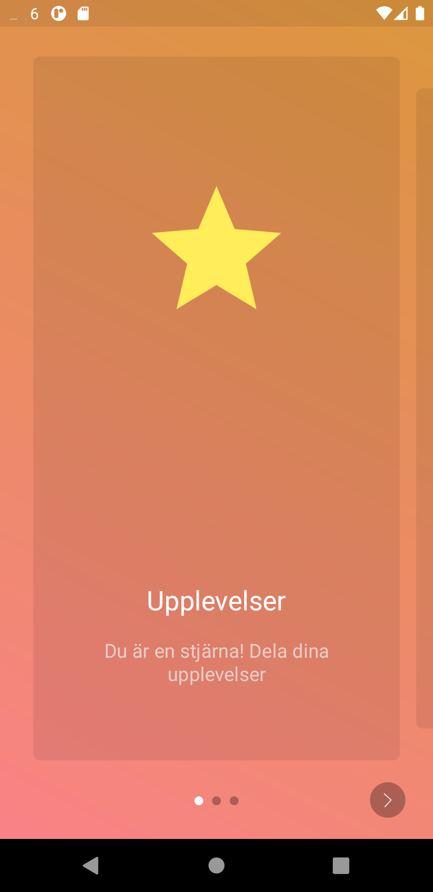
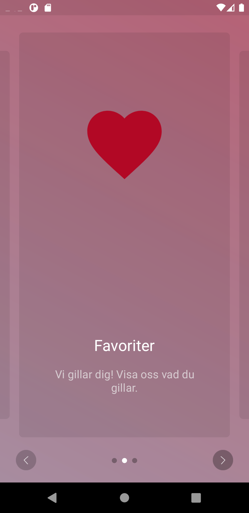
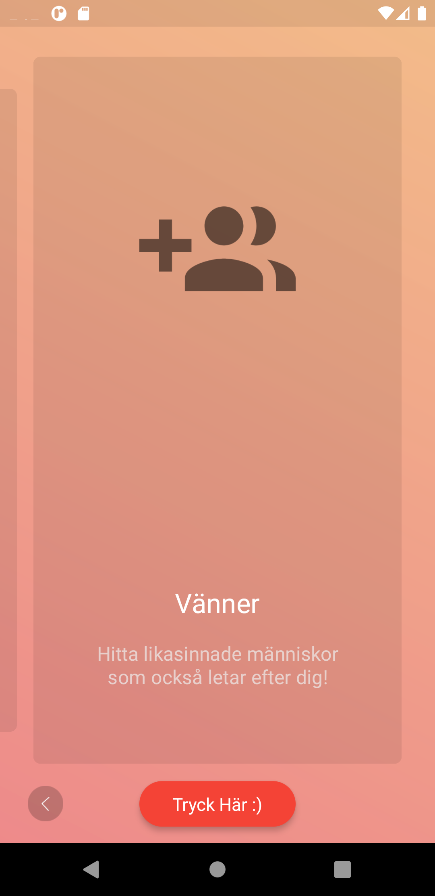
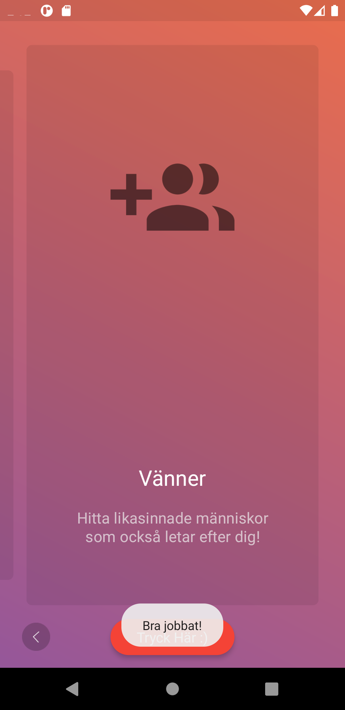

# Rapport
**1. Added the external library as a dependency in app/build.gradle**

```
dependencies {
...
    implementation 'com.codemybrainsout.onboarding:onboarder:1.0.4'
}
```


**2. Added the shifting gradient background alongside navigation control.**
```
public class MainActivity extends AhoyOnboarderActivity {

    @Override
    protected void onCreate(Bundle savedInstanceState) {
        super.onCreate(savedInstanceState);
        setContentView(R.layout.activity_main);

        showNavigationControls(true);
        setGradientBackground();
    }

    @Override
    public void onFinishButtonPressed() {
        Toast.makeText(this, "Bra jobbat!", Toast.LENGTH_SHORT).show();
    }
}
}
```

**3. Added cards with modified text alongside other modified vector images and modified button text and modified toast.***

The layout was set accordingly:
```
        AhoyOnboarderCard ahoyOnboarderCard1 = new AhoyOnboarderCard("Upplevelser", "Du är en stjärna! Dela dina upplevelser", R.drawable.ic_baseline_star_24);
        AhoyOnboarderCard ahoyOnboarderCard2 = new AhoyOnboarderCard("Favoriter", "Vi gillar dig! Visa oss vad du gillar.", R.drawable.ic_baseline_favorite_24);
        AhoyOnboarderCard ahoyOnboarderCard3 = new AhoyOnboarderCard("Vänner", "Hitta likasinnade människor som också letar efter dig!", R.drawable.ic_baseline_group_add_24);

        ahoyOnboarderCard1.setBackgroundColor(R.color.black_transparent);
        ahoyOnboarderCard2.setBackgroundColor(R.color.black_transparent);
        ahoyOnboarderCard3.setBackgroundColor(R.color.black_transparent);

        List<AhoyOnboarderCard> pages = new ArrayList<>();

        pages.add(ahoyOnboarderCard1);
        pages.add(ahoyOnboarderCard2);
        pages.add(ahoyOnboarderCard3);

        for (AhoyOnboarderCard page : pages) {
            page.setTitleColor(R.color.white);
            page.setDescriptionColor(R.color.grey_200);
        }

        //Set finish button text
        setFinishButtonTitle("Tryck Här :)");

        showNavigationControls(true);
        setGradientBackground();
        setOnboardPages(pages);
    }
 ```


__Image 1: Displays first card.__


__Image 2: Displays second card.__


__Image 3: Displays third card alongside the finish button.__


__Image 4: Demonstrates the button when pressed.__


#Library

The library; ahoy-onboarding which was used in this project was from github user codemybrainsout.
I have, in this README.md report clearly stated the modifications made. All unmodified parts are
preserved under license:
```
Copyright (C) 2016 Code My Brains Out

Licensed under the Apache License, Version 2.0 (the "License");
you may not use this file except in compliance with the License.
You may obtain a copy of the License at

http://www.apache.org/licenses/LICENSE-2.0

Unless required by applicable law or agreed to in writing, software
distributed under the License is distributed on an "AS IS" BASIS,
WITHOUT WARRANTIES OR CONDITIONS OF ANY KIND, either express or implied.
See the License for the specific language governing permissions and
limitations under the License.
```

for more info visit http://www.apache.org/licenses/LICENSE-2.0
